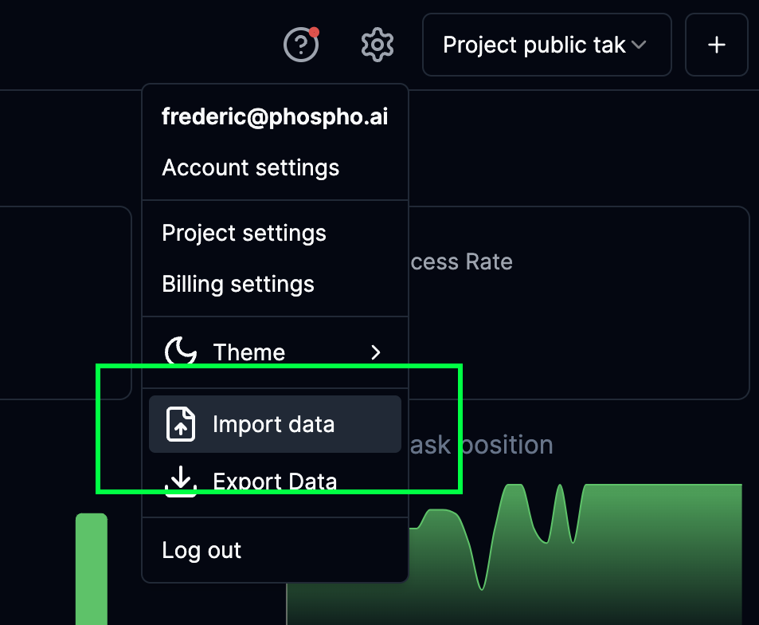
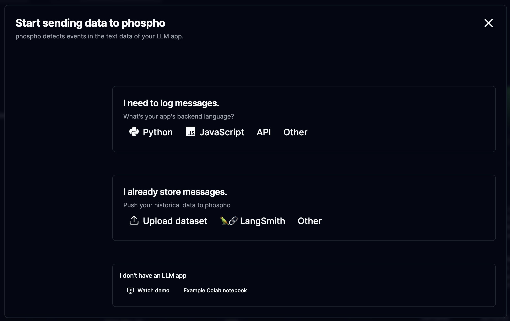
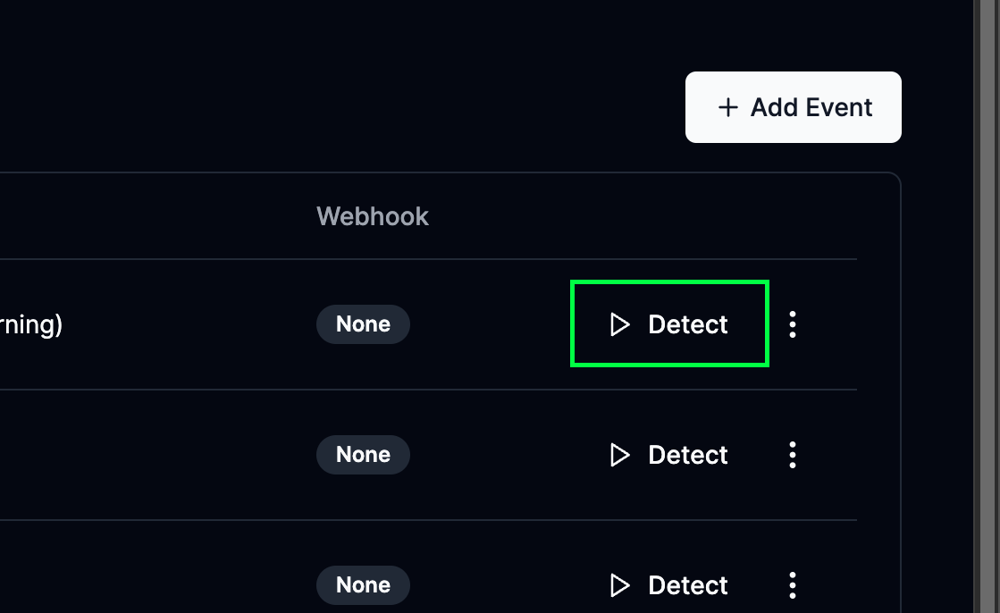

This guide will help you get started with the [phospho platform](https://platform.phospho.ai).

<Steps>
  <Step title="Create your phospho account">
    Create an account on [phospho.ai](https://platform.phospho.ai).
  </Step>
  <Step title="Import your data in a project">
    Import your data or try phospho in [Google Colab](https://colab.research.google.com/drive/1Wv9KHffpfHlQCxK1VGvP_ofnMiOGK83Q)
  </Step>
  <Step title="Setup events, and get insights on your dashboard">
    Analyze user interactions, explore the analytics and improve
    your app.
  </Step>
</Steps>

## 1. Create an account and login to phospho

Go to the [phospho platform](https://platform.phospho.ai/). Login or create an account if you don't have one.

<Info>
If this is your first time using phospho, a Default project has been created for you.
</Info>

## 2. Import your data in a project

### Import your data

In the header, to the right, look for the gears icon and click on it. 

You can then click on import data.



You now have different options, the easiest options are to import from a CSV/Excel file or to synchronise with LangSmith if you have existing data there.

For other options, you can take a look at the [technical documentation](/getting-started) to import data directly from your system.



#### Import from a CSV file

You can import a CSV/Excel file with the following format:

```csv
input,output,task_id,session_id,created_at
"Hello! This is what the user asked to the system","This is the response showed to the user by the app.","task_1","session_1","2024-05-31 12:31:22"
```

<Info>
- Make sure that your CSV is a valid CSV file separated by a comma. 
- Make sure the created_at field is in the format `YYYY-MM-DD HH:MM:SS`.
</Info>

#### Import from LangSmith

You can import existing data from [LangSmith](https://smith.langchain.com) by providing the LangSmith API key and your LangSmith project name.

We will periodically fetch your data from LangSmith and import it into phospho.

<Note>
This data is encrypted and stored securely. We need it to periodically fetch your data from LangSmith and import it into phospho.
</Note>

## 3. Define and run events in the past

### Using events

Events are the key to getting insights from your data. 

An event is a specific interaction between a user and the system you want to track.

To define an event, go to the **Events** tab in the phospho platform and click on the **Add Event** button.


In this tab you can setup events in natural language, in this image, we have setup an event to detect when the system is unable to answer the user's question.

#### Run events in the past

Once you've defined your events, you can run them on past data.

Click on the Detect events button in the **Events** tab to run an event on your data.



## 4. That's it, you're all set !

You can now [Leverage your data](/guides/leveraging-your-data), analyze it, and get insights on your dashboard.

## Next steps

Learn to use the phospho platform with our guides:

<CardGroup>
  <Card title="LLM as a judge" href="/guides/LLM-judge">
    Setup LLM as a judge in your application. **Detect events** in your data.
  </Card>
  <Card title="User Intentions" href="/guides/user-intentions">
    Detect user intentions and **get a global overview** your LLM app.
  </Card>
  <Card title="Understand your data" href="/guides/understand-your-data">
    Get insights on your data through vizualisation, clustering and more.
    **Quick and easy**
  </Card>
</CardGroup>
