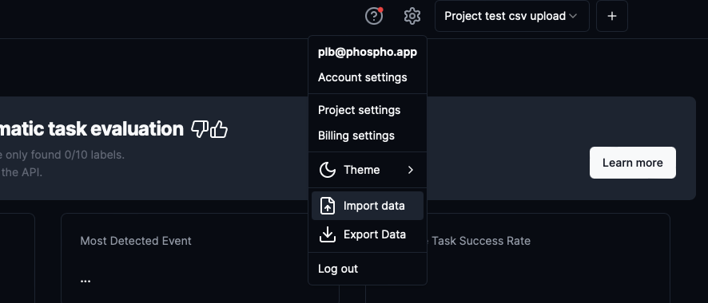
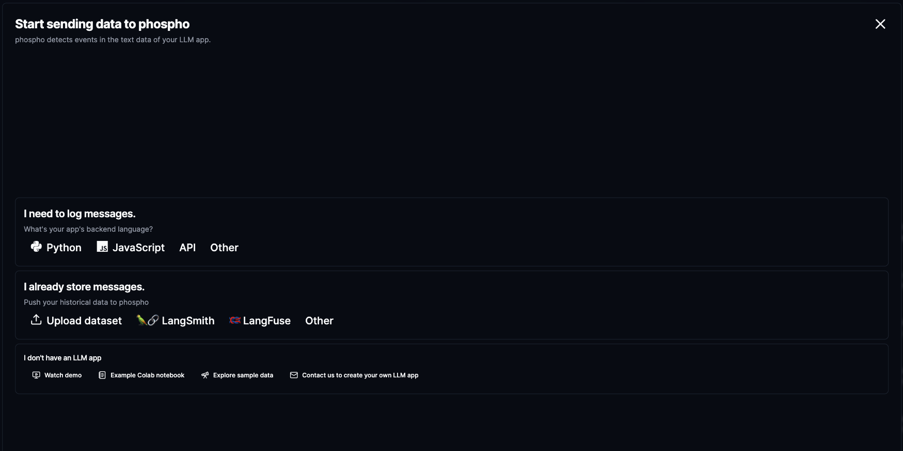

# Format your csv file

Your CSV file need to have the following columns:

- `input` : the input text data, ususally the user message
- `output` : the output text, ususally the LLM app response

Additonally, you can add the following columns:

- `task_id`: an id of the task (input/output couple)
- `session_id`: an id of the session, tasks with the same session_id will be grouped together in a single session
- `created_at`: the creation date of the task (format it like `"2021-09-01 12:00:00"`)

The maximum upload size with this method is 500MB.

# Upload your CSV file to the plateform

Click the setting icon at the top right of the screen and select `Import data`.

Then click, the **Upload dataset** button and use **Choose file** button to select your CSV file.

Your tasks will be populated in your project in a minute. You might need to refresh the page to see them.

# Next steps

Default evaluators like language and sentiment will be runned on your tasks. To create more events and to run them on your uploaded tasks, see the [event detection page](/guides/events)
