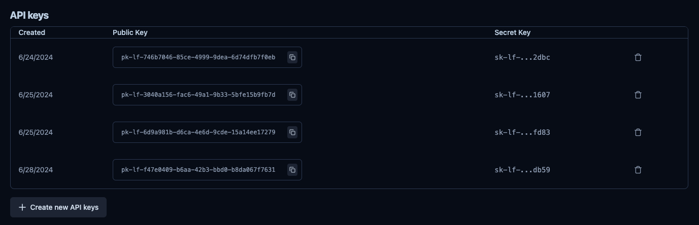

# Go to langfuse and head to settings

Go to your [langfuse](https://cloud.langfuse.com/) account and head to the settings page, in the bottom left.

You will reach the API Keys page where you can create a new API key.

Click on Create new API keys, you will need both the secret key and the public key.

# Head to phospho and import your data

Click the settings icon at the top right of the screen and select `Import data`.

Then click, the **Import from langfuse** button.

You can now copy your Secret Key and your Public Key in the input fields.

<Note>
This data is encrypted and stored securely. We need it to periodically fetch your data from LangFuse and import it into phospho.
</Note>

Your tasks will be populated in your project in a minute. You might need to refresh the page to see them.

# Next steps

Default evaluators like language and sentiment will be runned on your tasks. To create more events and to run them on your uploaded tasks, see the [event detection page](/guides/events)
