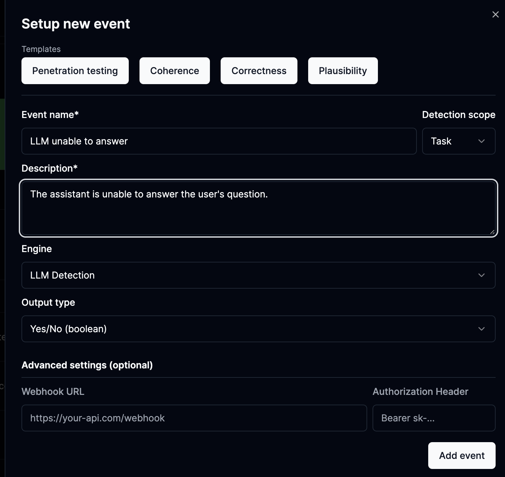

Learn how to define and run events in phospho, and also how they work under the hood and how to improve them.

## What are events in phospho?

Events are **actions** or **behaviours** that you want to track in your data. There are three types of events:

- **Tags**: Tags are detected in the data and can be used to filter data. Tags are described in natural language. Tags are either present, or not present in a message.
- **Scores**: Scores are values between 1 and 5 that are assigned to a message. Scores can be used to track the quality of the conversation.
- **Categories**: Categories are the result of a classification. Use categories to classify messages in different classes. For example, if you have a set of user intents, you can classify messages in these intents.

## Create an event

An event is a specific interaction between a user and the system you want to track.

To define an event, go to the **Events** tab in the phospho platform and click on the **Add** button.

In this tab you can setup events in natural language, in this image, we have setup an event to detect when the system is unable to answer the user's question.

By default, events are detected on all the newly imported data, but not on the past data. You need to run the events on the past data to get insights.

## Run events on imported data

Once you've defined your events, you need to run them on past data. 

Click on the Detect events button in the **Events** tab to run an event on your data.

## How are events detected?

Every message logged to phospho goes through an analytics pipeline. In this pipeline, phospho looks for **events** defined in your project settings.

This pipeline uses a combination of **rules**, **machine learning**, and **large language models** to detect events. The rules are defined in the **Analytics** tab of the phospho dashboard.

## How good is the event detection?

To help you keep track and improve the event detection, phospho enables you **annotate** and **validate** the events detected in your data.

Click on an event in the **Transcripts** to annotate it. This will display a dropdown where you can validate, remove or edit the event.

Advanced **performance metrics** (F1 Score, Accuracy, Recall, Precision, R-squared, MSE) are available when you click on an event in the Analytics tab.

## Automatic improvement of the event detection

The event detection models are **automatically improved** and updated using **your feedback.** 

<Note>
The more you annotate and validate the events on the platform, the better the events become !
</Note>

Click on an event in the **Transcripts** to annotate it. This displays a dropdown where you can validate, remove or edit the event.

We are constantly improving our algorithms to provide the best results. We're an open source project, so feel free to open an issue on our [GitHub](https://github.com/phospho-app/phospho/issues) or contribute to the codebase. We would love to hear from you!