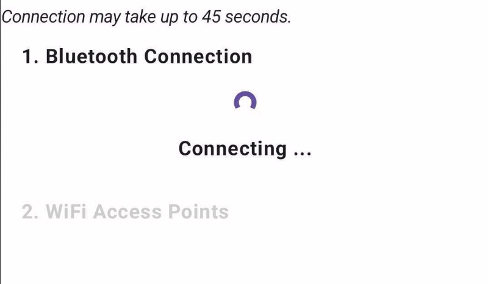

<Accordion title="Having trouble?"
description="Use your phone's bluetooth to connect the control module to wifi">

Using the **BTBerryWifi** app, you can use bluetooth to connect the control module to your home wifi.

## Step 1: Download the BTBerryWifi app

Download the _BTBerryWifi_ app for your smartphone:

- on **iPhone,** [download the app from the AppStore.](https://apps.apple.com/us/app/btberrywifi/id1596978011)
- on **Android,** [download the apk here.](https://drive.google.com/drive/folders/12l5lCZS4T8wHfdSLyCGM-hrzh64EM-zo?usp=sharing) Install it with sideloading. _Note: the free version of the Android app only works for 7 days._

## Step 2: Reboot the control module

1. Long press the _power button_ of the control module until the LED turns red.
2. Press the _power button_ again and keep it pressed until the LED turns green.
3. Wait for the control module to boot up. When the LED blinks green slowly and regularly, then your control module is ready for pairing.

<Warning>
Make sure no device is connected to the control module through Wifi.
</Warning>

## Step 3: Connect to Wifi with BTBerryWifi

<Info>For reference, here's the link to the [full user guide](https://www.btberrywifi.com/).</Info>

1. Launch **BTBerryWifi.** Accept the autorization request to use bluetooth. Click on the button "Scan for Raspberry Pi".

2. Wait for _phosphobot_ to show up in the list below, then select it. 

<Note>sometimes, you can see _no_name_ instead of _phosphobot_ in the list. If so, select _no name_ and carry on.</Note>

If no device shows up, close the app, switch bluetooth off and on on your smartphone, and reboot the control module. Then start again.

3. Wait for your smartphone to pair with the control module, then for the Wifi access points to appear. This can take up to a minute.

If you stay stuck on this screen for longer than 2 minutes, close the app, switch bluetooth off and on on your smartphone, and reboot the control module. Then start again.

4. Select your home wifi in the list. Then, enter the wifi password. This will connect the control module to the wifi network.

Then enter the Wifi password and press connect.

<Note>This step may fail if you're trying to connect to a Wifi hotspot. If this happens to you, look into how to flash your own SD card.</Note>

### That's it!

You're done. The control module is now connected to wifi.

</Accordion>
