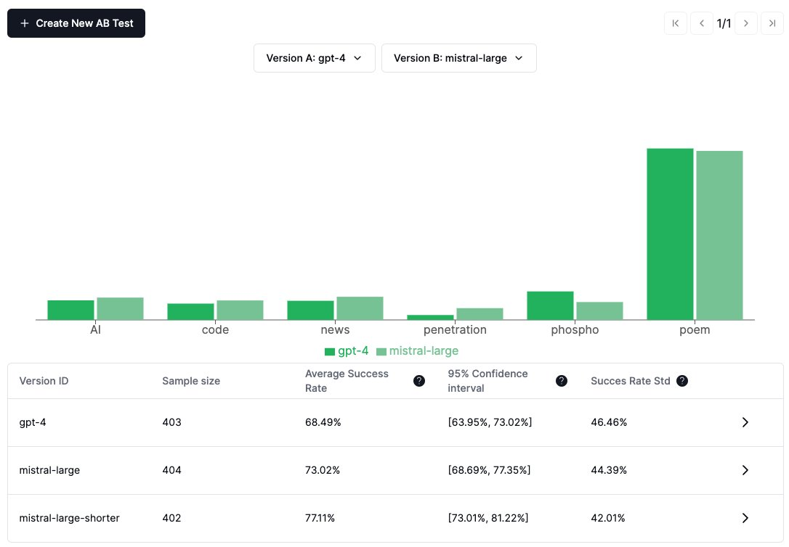

AB testing lets you compare different versions of your app to see which one performs better.



## What is AB testing

AB testing is a method used to compare two versions of a product to determine which performs better. 

Comparing on a single criteria is hard, especially for LLM apps. Indeed, the performance of a product can be measured in many ways.

In phosho, the way AB testing is done is by comparing the **[analytics distribution](/docs/guides/events) of two versions**: the candidate one and the control one.

## Prerequisites to run an AB test

You need to have setup [event detection](/docs/guides/events) in your project. This will run analytics to measure the performance of your app: 

- **Tags:** eg. topic of the conversation
- **Scores:** eg. sentiment of the conversation (between 1 and 5)
- **Classifiers:** eg. user intent ("buy", "ask for help", "complain")

## Run an AB test from the platform

1. Click on the button "Create an AB test" on the phospho platform. If you want, customize the `version_id`, which is the name of the test. 

2. Send data to the platform [by using an SDK, an integration, a file, or more](/docs/getting-started). All new incomming messages will be tagged with the `version_id`. 

## Alternative: Specify the `version_id` in your code

Alternatively, you can specify the `version_id` in your code. This will override the `version_id` set in the platform.

When logging to phospho, add a field `version_id` with the name of your version in `metadata`. See the example below:

=== "Python"

    ```python
    log = phospho.log(
        input="log this",
        output="and that",
        version_id="YOUR_VERSION_ID"
    )
    ```

=== "Javascript"

    ```javascript
    log = phospho.log({
    input: "log this",
    output: "and that",
    version_id:"YOUR_VERSION_ID",
    });
    ```

=== "API"

    ```bash
    curl -X POST https://api.phospho.ai/v2/log/$PHOSPHO_PROJECT_ID \
    -H "Authorization: Bearer $PHOSPHO_API_KEY" \
    -H "Content-Type: application/json" \
    -d '{
        "batched_log_events": [
            {
                "input": "your_input",
                "output": "your_output"
                "metadata": {
                    "version_id": "YOUR_VERSION_ID"
                }
            }
        ]
    }'
    ```

## Run offline tests

If you want to run offline tests, you can use the [phospho command line interface](/docs/docs/cli). Results of the offline tests are also available in the AB test tab.

<div class="grid cards" markdown>

-   :octicons-terminal-16:{ .lg .middle } __phospho CLI__

    ---

    Learn more about the phospho command line interface

    [:octicons-arrow-right-24: Read more](#)

</div>
