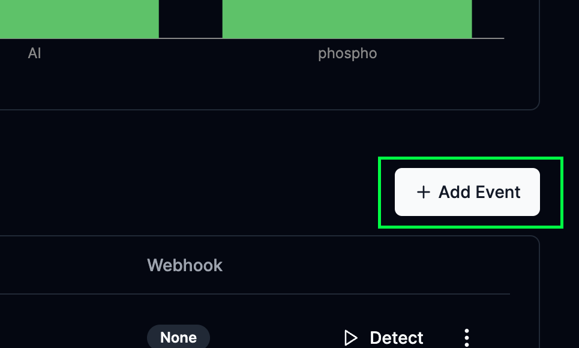
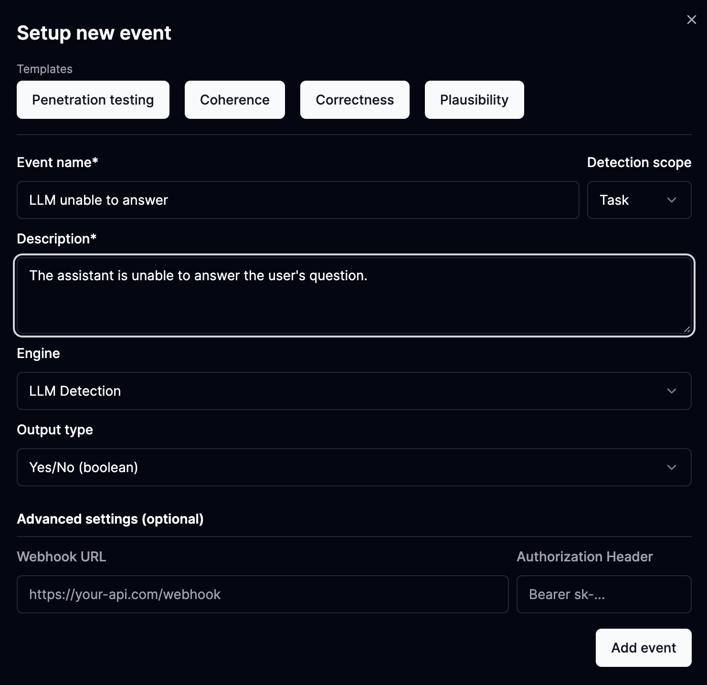

The [phospho platform](https://phospho.ai/) allows you to run events on your logs to score and analyze certain aspects of your data.

One of the ways to setup such events is through **LLM as a judge techniques**.

These can help you detect fraudulent inputs, angry customers, and more largely, to monitor your LLM apps.

## Walkthrough

The platform allows you to create events that leverage LLM as a judge techniques, let's see how you can achieve this in 3 simple steps.

### 1. Head to the Events tab

Starting from the platform, head to the **Events** tab on the top/left side of the screen.

This takes us to a panel of all the events that have been created.

The top part of the screen shows us the **top performing events**, while the bottom part shows us all the events that have been created.

### 2. Add an event

To set up LLM as a judge, let's click on the **Add Event** button on the right side of the screen.

### 3. Create your LLM as a judge based event

A panel opens up with information to configure, it should look something like this.

Let's imagine we want flag a conversation whenever our LLM app is unable to answer a user's question.

Let's configure an event to detect this.

Events are configured through these fields:

- **Event name**: The name of the event, this can be anything you like, ie: _"LLM unable to answer"_
- **Description**: A description of the event, explain what the event is about, in natural language, refer to the user as "the user" and to the LLM as "the assistant" ie: _"The assistant is unable to answer the user's question"_

Then press **Add Event** to save your event.

All future logs will be analyzed for this event. If it is detected, we will flag the log.

!!! info
    You can also setup more advanced events by changing these parameters:
     
    - **Detection scope**: This is the range of messages that the LLM should look at, it can be the task (User/Assistant exchange), the session(the whole conversation), the task input only (User message), or the task output only (Assistant message).
    - **Engine**: By default events are setup with LLM as a judge techniques but you can also match regexes, and keywords. We are working hard to expend this list.
    - **Output Type**: The type of output you want to get from the event, you can choose between **Boolean** (event is either present or not) and **Score** (we score the likelyhood of this event from 0 to 5).
    - **Webook**: To leverage this event and connect it to other services, you can set up a Webhook URL which will be called when the event is detected.

## Example events to setup

With this technique, you can setup a wide range of events, here are some examples:

**Penetration testing and fraud detection**: The user is trying to jailbreak the assistant

**Human interaction request**: The user is asking for a human to take over the conversation

**LLM unable to answer**: The assistant is unable to answer the user's question

**Code request**: The user is asking the assistant to write or review code

**Information request**: The user is asking the assistant for more specific information

## Next steps

-   :material-target:{ .lg .middle } __Figure out User Intentions__

    ---

    Figure out what your users are talking about. **See through the fog**

    [:octicons-arrow-right-24: Read more](#)

-   :material-chart-pie:{ .lg .middle } __Understand your data__

    ---

    Get insights on your data through visualization, clustering and more. **Quick and easy**

    [:octicons-arrow-right-24: Read more](#)

