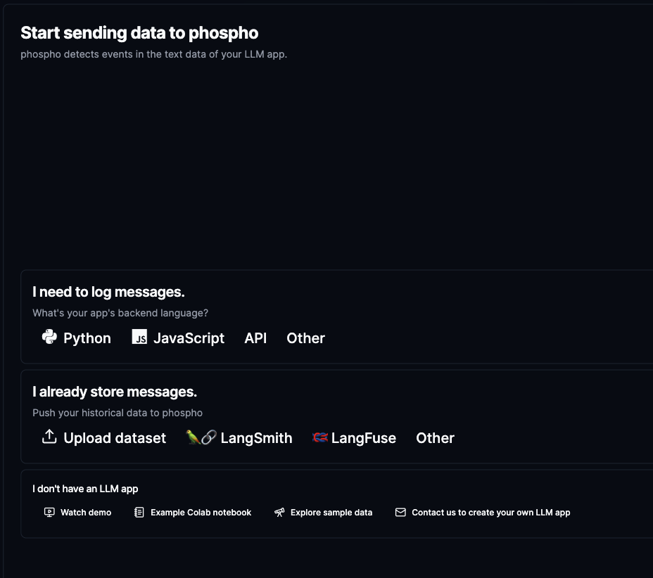
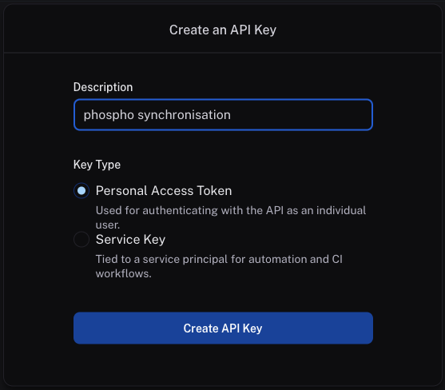
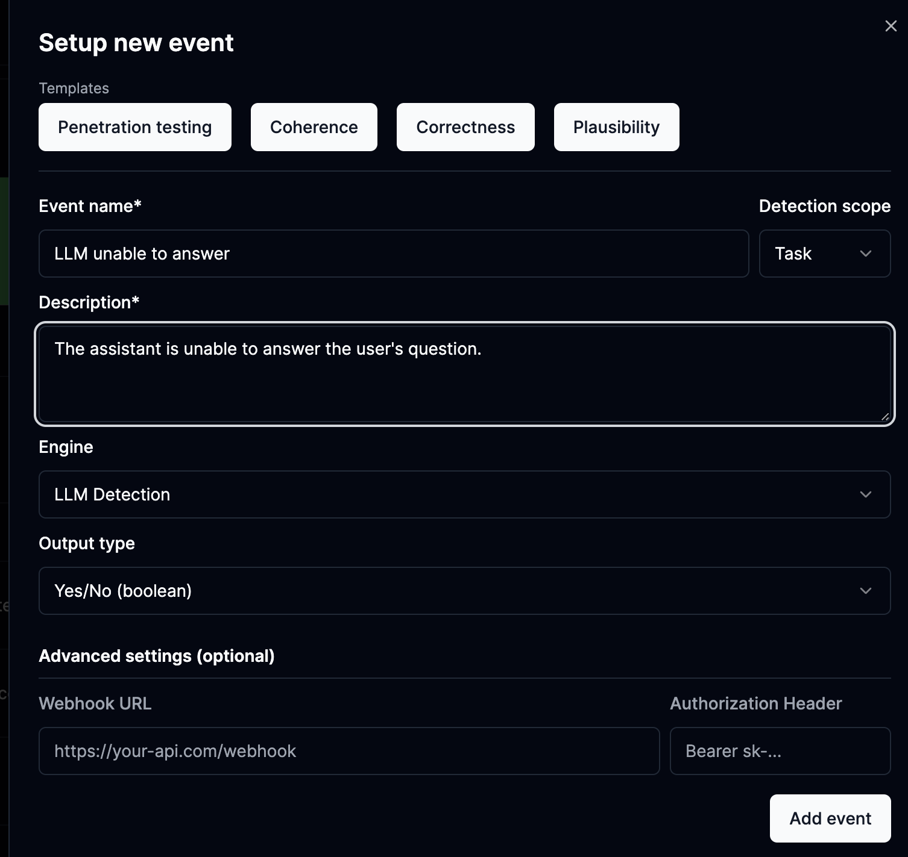
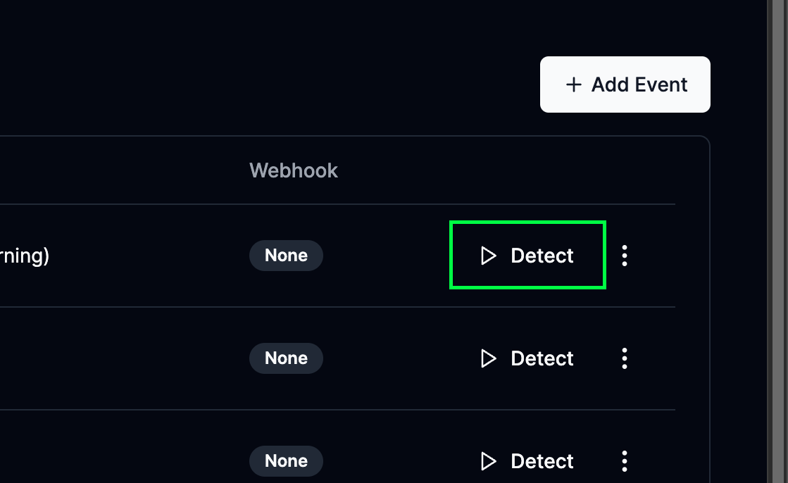

This guide will help you get started with the [phospho platform](https://platform.phospho.ai).

1. Create an account on [phospho.ai](https://platform.phospho.ai).
2. Import your data
  - From [CSV/Excel](#import-from-file)
  - From [LangSmith](#import-from-langsmith)
  - From [LangFuse](#import-from-langfuse)
  - From [API](/docs/getting-started)
3. Setup events, and get insights on your dashboard
    Analyze user interactions, explore the analytics and improve
    your app.


## 1. Create an account and login to phospho

Go to the [phospho platform](https://platform.phospho.ai/). Login or create an account if you don't have one.

!!! info
    If this is your first time using phospho, a Default project has been created for you.


## 2. Import your data in a project

### Import your data

In the header, to the right, look for the gears icon and click on it. 

You can then click on import data.


You now have different options, the easiest options are to import from a CSV/Excel file, to synchronise with LangSmith or LangFuse if you have existing data there.

For other options, you can take a look at the [technical documentation](/docs/getting-started) to import data directly from your system.



#### Import from file

You can import a CSV or a Excel file into phospho.

??? info "How to import a CSV to phospho"

    Head over to the [phospho](https://platform.phospho.ai) platform and click on the settings icon at the top right of the screen. Then select `Import data`.

    

    Click on the **Upload dataset** button.

    

    You can now drag and drop your file or click on the box to select it.

    You should have the following columns in your file:

    ```csv
    input;output;task_id;session_id;created_at
    "Hello! This is what the user asked to the system";"This is the response showed to the user by the app.";"task_1";"session_1";"2024-05-31 12:31:22"
    ```

    !!! info
        - Make sure that your CSV is a valid CSV file separated by a colon or a semicolon.
        - Make sure the created_at field is in the format `YYYY-MM-DD HH:MM:SS`.


#### Import from LangSmith

You can import existing data from [LangSmith](https://smith.langchain.com) by providing the LangSmith API key and your LangSmith project name.

We will periodically fetch your data from LangSmith and import it into phospho.

??? info "How to connect LangSmith to phospho"

    In your [langsmith](https://cloud.langsmith.com/) account, head to the settings page in the bottom left.

    You will reach the API Keys page where you can create a new API key in the top right corner.

    

    Create a new API key and copy it.

    You can now head to the [phospho](https://platform.phospho.ai) platform.

    Click the settings icon at the top right of the screen and select `Import data`.

    

    Then click, the **Import from langsmith** button.

    You can now copy your API key in the input field and enter the name of your langsmith project to copy.

    !!! note
        This data is encrypted and stored securely. We need it to periodically fetch your data from LangSmith and import it into phospho.

    

    Your data will be synced to your project in a minute. 


#### Import from LangFuse

You can import existing data from [LangFuse](https://cloud.langfuse.com/) by providing your LangFuse Public and Secret keys.

We will periodically fetch your data from LangFuse and import it into phospho.

??? info "How to connect LangFuse to phospho"

    Head to your [langfuse](https://cloud.langfuse.com/) account, and go to the settings page, in the bottom left.

    You will reach the API Keys page where you can create a new API key.

    

    Click on Create new API keys, you will need both the secret key and the public key.

    You can now head to [phospho](https://platform.phospho.ai).

    Click the settings icon at the top right of the screen and select `Import data`.

    

    Then click, the **Import from langfuse** button.

    You can now copy your Secret Key and your Public Key in the input fields.

    !!! note
        This data is encrypted and stored securely. We need it to periodically fetch your data from LangFuse and import it into phospho.


    

    Your data will be synced to your project in a minute. 


## 3. Define and run events in the past

### Using events

Events are the key to getting insights from your data. 

An event is a specific interaction between a user and the system you want to track.

To define an event, go to the **Events** tab in the phospho platform and click on the **Add Event** button.



In this tab you can setup events in natural language, in this image, we have setup an event to detect when the system is unable to answer the user's question.

#### Run events in the past

Once you've defined your events, you can run them on past data.

Click on the Detect events button in the **Events** tab to run an event on your data.



## 4. That's it, you're all set !

You can now [understand your data](/docs/guides/understand-your-data), analyze it, and get insights on your dashboard.

## Next steps

Learn to use the phospho platform with our guides:

<div class="grid cards" markdown>

-   :material-gavel:{ .lg .middle } __LLM as a judge__

    ---

    Setup LLM as a judge in your application. **Detect events** in your data.

    [:octicons-arrow-right-24: Read more](./LLM-judge.md)

-   :material-target:{ .lg .middle } __User Intentions__

    ---

    Detect user intentions and **get a global overview** of your LLM app.

    [:octicons-arrow-right-24: Read more](./user-intent.md)

-   :material-chart-pie:{ .lg .middle } __Understand your data__

    ---

    Get insights on your data through visualization, clustering and more. **Quick and easy**

    [:octicons-arrow-right-24: Read more](./understand-your-data.md)

</div>
