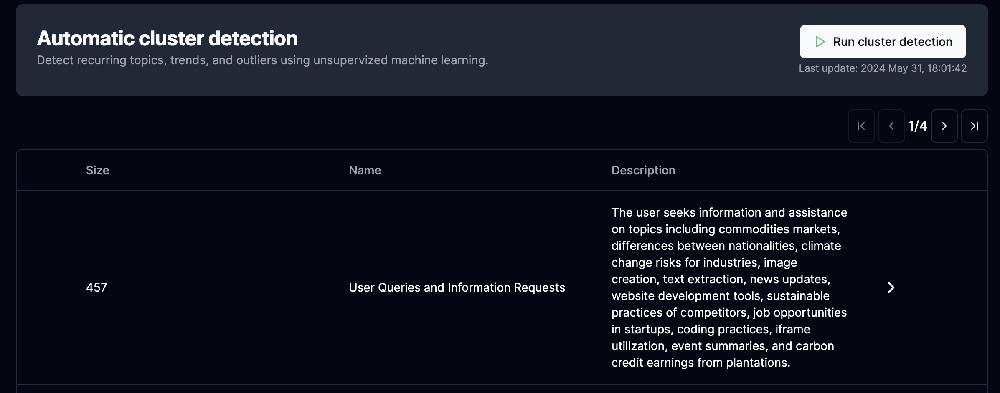

## Get insights

Now that you've imported your data and defined events, you can analyze your data in several ways.

### Filtering

Go to your [transcripts](https://platform.phospho.ai/org/transcripts/tasks) and filter your data to visualize interactions.

!!! info
    You can combine filters to get more specific results.

### Clustering

Clustering is a powerful tool to group similar interactions together.

We will automatically analyze your data to group similar interactions together.

This gives you a better understanding of your data and what your users are talking about.

### Dataviz

The **Dataviz** tab enables you to visualize your data in different ways.

Plot any metric against any other metric and display them.

!!! info
    You can log and track any metric you want by adding them in the metadata field of your data.

## More to come, let us know what you'd like to see!

Contact us on our socials below or send us an email at [paul-louis@phospho.app](mailto:paul-louis@phospho.app).
