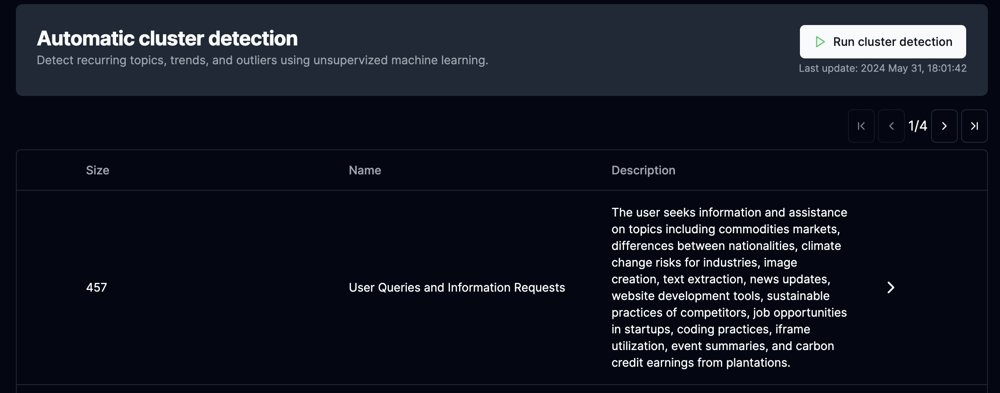

The [phospho platform](https://phospho.ai/) allows you to explore user intentions through clustering techniques.

This guide will show you how to achieve this.

<iframe
  width="100%"
  height="600px"
  src="https://www.youtube.com/embed/WwvBXJieiW0?si=q--tDY1iqON0GHo5"
  allowFullScreen
></iframe>

Make sure you have [imported your data](/docs/guides/getting-started) before starting this guide.

## Walkthrough

## 1. Go to the clustering tab

Once on the platform, go to the **clustering** tab in the menu on the left of the screen.

On here, phospho runs various algorithms to analyze your user interactions and detect patterns.

We **group similar interactions** together to help you understand what your users are talking about.

### 2. Run the clustering

Click on **Run cluser detection** to start the process.

 
!!! info
    Clustering is not yet a continuous process, you will need to re-run it
    manually to get the latest results.

## How it works

Phospho uses the phospho `intent-embed` model to represent user interactions in a high-dimensional space. Then, we use clustering techniques to group similar user messages together.
Finaly, we generate a summary of the clusters to help you understand what your users are talking about.

## Next steps

-   :material-gavel:{ .lg .middle } __LLM as a judge__

    ---

    Leverage LLM as a judge techniques to analyze your LLM app's performance. **Quick and simple setup**

    [:octicons-arrow-right-24: Read more](#)

-   :material-chart-pie:{ .lg .middle } __Understand your data__

    ---

    Get insights on your data through visualization, clustering and more. **Quick and easy**

    [:octicons-arrow-right-24: Read more](#)

