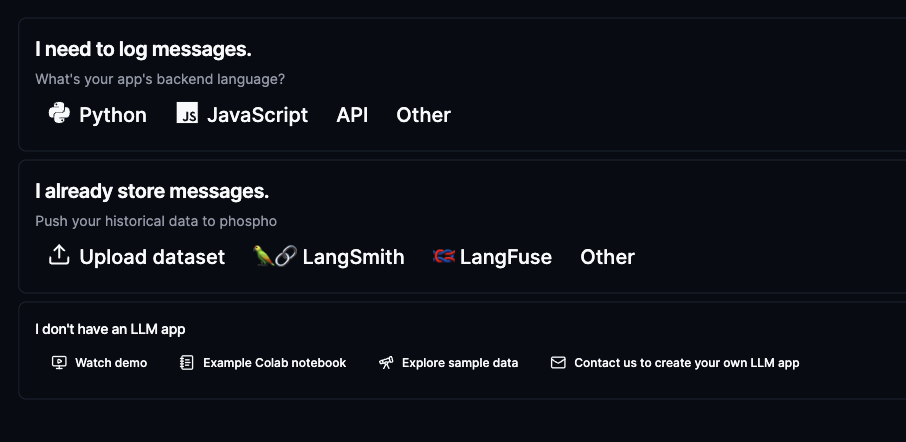

# Go to Langsmith and head to settings

Go to your [langsmith](https://cloud.langsmith.com/) account and head to the settings page in the bottom left.

You will reach the API Keys page where you can create a new API key in the top right corner.

Create a new API key and copy it.

# Head to phospho and import your data

Click the settings icon at the top right of the screen and select `Import data`.

Then click, the **Import from langsmith** button.

You can now copy your API key in the input field and enter the name of your langsmith project to copy.

<Note>
  This data is encrypted and stored securely. We need it to periodically fetch
  your data from LangSmith and import it into phospho.
</Note>

Data will be synced to your project in a minute.

# Next steps

Default evaluators like language and sentiment will be run on your data. To create more events and to run them on your data, see the [event detection page](/docs/guides/events)
