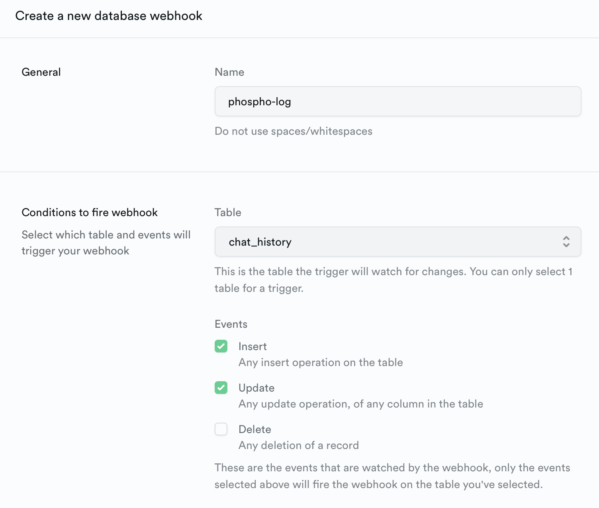

phospho is a platform that helps you build better chatbots by providing AI analytics about the user experience of your chatbot.

[Supabase](https://supabase.com/) is an open-source database, authentication system, and hosting platform that allows you to quickly and easily build powerful web-based applications. 

If you're using Supabase to build a chatbot, here's how you can log your chatbot messages to phospho using a Supabase Database webhook, a Supabase Edge Function, and the phospho API.

## Prerequisites

We assume in this guide that you have already set up a Supabase project. 

```bash
npm i supabase
supabase init
supabase login
```

We also assume that you have already created the chatbot UI using Supabase ([here's a template](https://github.com/mayooear/langchain-supabase-website-chatbot)).

## Add the phospho API key and project id to your Supabase project

[Create an account on phospho](https://app.phospho.ai/dashboard) and get your API key and project id from the Settings.

Then, add the `PHOSPHO_API_KEY` and `PHOSPHO_PROJECT_ID` secrets to your Supabase project.

### Option 1: In the CLI

Add the phospho API key and project id to your `./supabase/.env` file:

```bash .env
PHOSPHO_API_KEY="..."
PHOSPHO_PROJECT_ID="..."
```

Push those secrets to your Supabase project:

```bash
supabase secrets set --env-file ./supabase/.env
```

### Option 2: In the console UI

Add directly the phospho API key and project id as Edge Functions Secrets in the Supabase console. Go to Settings/Edge Functions, and create the `PHOSPHO_API_KEY` and `PHOSPHO_PROJECT_ID` secrets.


## Setup your chat_history table

If you're using Supabase to build a chatbot, you probably already have a table that stores the chat history of your users. This table lets your users access their chat history on your app event after they close the website. 

If you don't, **you need to create a `chat_history` table.**

Here's what your `chat_history` table should look like:

| message_id | chat_id | user_message | assistant_response         | metadata                    |
| ---------- | ------- | ------------ | -------------------------- | --------------------------- |
| c8902bda28 | 9bc8eda | Hi           | Hello! How can I help you? | \{"model_name": "gpt-3.5"\} |

Here are the columns of the table:

- `message_id` (UUID), the unique id of the message. 
- `chat_id` (UUID), the unique id of the chat. All the messages from the same conversation should have the same `chat_id`.
- `user_message` (TEXT), the message sent by the user.
- `assistant_response` (TEXT), is the response displayed to the user. It can be the direct generation of an LLM, or the result of a multistep generation.
- (Optional)` metadata` (JSON), a dictionary containing metadata about the message

### Create the table 

In Supabase, create a new table called `chat_history` with the columns described above. Customize the table to match your app behaviour.

Here's for example the SQL code to create the table with the columns described above:

```sql
create table
  public.chat_history (
    message_id uuid not null default gen_random_uuid (),
    chat_id uuid not null default gen_random_uuid (),
    user_message text not null,
    assistant_response text null,
    metadata json null,
    constraint chat_history_pkey primary key (message_id)
  ) tablespace pg_default;
```

### Update the table

The table `chat_history` should be updated every time a new message is sent to your chatbot. 

Example of how to insert a new row in the chat_history table with Supabase:

```javascript
// The first time a user sends a message, let the chat_id be generated automatically
const { firstMessage, error } = await supabase
  .from('chat_history')
  .insert({ 
    user_message: userMessage, // The message sent by the user
    assistant_response: assistantResponse, // The response displayed to the user, eg LLM generation
    metadata: metadata // Optional Object
}).select()

// We get the chat_id of the first message
const chat_id = firstMessage.chat_id

// The next time the user sends a message, we use the same chat_id
// This groups all the messages from the same conversation
const { error } = await supabase
  .from('chat_history')
  .insert({ 
    chat_id: chat_id, 
    user_message: userMessage, 
    assistant_response: assistantResponse, 
    metadata: metadata
}).select()
```

## Setup the Supabase Edge Function

Let's create a [Supabase Edge Function](https://supabase.com/docs/guides/functions/quickstart) that will log the chat message to phospho using the [phospho API](/docs/api-reference). Later, we will trigger this function with a Supabase Database webhook.

### Create the Edge Function

Create a new Edge Function called phospho-logging inside your project:

```bash
supabase functions new phospho-logging
```

This creates a function stub in your `supabase` folder:

```bash
└── supabase
    ├── functions
    │   └── phospho-logging
    │   │   └── index.ts ## Your function code
    └── config.toml
```

### Write the code to call the phospho API

In the newly created `index.ts` file, we add a basic code that: 

1. Gets the phospho API key and project id from the environment variables.
2. Converts the payload sent by Supabase to the format expected by the phospho API.
3. Sends the payload to the phospho API.

Here's an example of what the code could look like:

```javascript supabase/functions/phospho-logging/index.ts
// Get the phospho API key and project id from the environment variable
const phosphoApiKey = Deno.env.get("PHOSPHO_API_KEY");
const phosphoProjectId = Deno.env.get("PHOSPHO_PROJECT_ID");
const phosphoUrl = `https://api.phospho.ai/v2/log/${phosphoProjectId}`;

// This interface describes the payload sent by Supabase to the Edge Function
// Change this to match your chat_history table
interface ChatHistoryPayload {
  type: "INSERT" | "UPDATE" | "DELETE";
  table: string;
  record: {
    message_id: string;
    chat_id: string;
    user_message: string;
    assistant_response: string;
    metadata: {
      model_name: string;
    };
  };
}

Deno.serve(
  async (req: {
        json: () => ChatHistoryPayload | PromiseLike<ChatHistoryPayload>;
  }) => {
    if (!phosphoApiKey) {
        throw new Error("Missing phospho API key");
    }
    if (!phosphoProjectId) {
        throw new Error("Missing phospho project id"); 
    }

    const payload: ChatHistoryPayload = await req.json();

    // Here, we react to the INSERT and UPDATE events on the chat_history table
    // Change this to match your chat_history table
    if (payload.record.user_message && (payload.type === "UPDATE" || payload.type === "INSERT")) {
        // Here, we convert the payload to the format expected by the phospho API
        // Change this to match your chat_history table
        const phosphoPayload = {
        batched_log_events: [
            {
                // Here's how to map the payload to the phospho API
                task_id: payload.record.message_id,
                session_id: payload.record.chat_id,
                input: payload.record.user_message,
                output: payload.record.assistant_response,
            },
        ],
        };

        // Send the payload to the phospho API
        const response = await fetch(phosphoUrl, {
        method: "POST",
        headers: {
            Authorization: `Bearer ${phosphoApiKey}`,
            "Content-Type": "application/json",
        },
        body: JSON.stringify(phosphoPayload),
        });

        if (!response.ok) {
        throw new Error(
            `Error sending chat data to Phospho: ${response.statusText}`
        );
        }

        return new Response(null, { status: 200 });
    }

    return new Response("No new chat message detected", { status: 200 });
  }
);
```

Feel free to change the code to adapt it to your `chat_history` table and to how you chat messages are stored. 

### Deploy the Edge Function

Deploy the function to your Supabase project:

```bash
supabase functions deploy phospho-logging --project-ref your_supabase_project_ref
```

<Note>Your Supabase project ref which can be found in your console url: `https://supabase.com/dashboard/project/project-ref`</Note>

## Setup the Supabase Webhook

Now that you have created the Supabase Edge Function, create a Supabase Database webhook to trigger it.

### Create the webhook

In the Supabase console, go to Database/Webhook. 


Click on Create new in the top right. Make the webhook trigger on the `chat_history` table, and on the `INSERT` and `UPDATE` events. 



### Call the Edge Function with authentication

In the webhook configuration, select the type of webhook "Supabase Edge Function" and select the `phospho-logging` you just deployed. 

In the HTTP Headers section, add an `Authorization` header with the value `Bearer ${SUPABSE_PROJECT_ANON_PUBLIC_KEY}`. Find your anon public key in the console, in the tabs Settings/API/Project API keys.


### Test the webhook

To test the webhook, insert a row in the `chat_history` table, and the webhook should be triggered. You'll see the logs in the phospho dashboard.

You can also send a message to your chatbot. This will now trigger the webhook and log the message to phospho.

## Next steps

You're done! Your are now logging the chatbot messages to phospho and can learn how the users interact with your chatbot using the phospho dashboard and AI analytics.

Learn more about phospho features by reading the [guides](/docs/guides):

<div class="grid cards" markdown>

-   :material-comment-text:{ .lg .middle } __Log user feedback__

    ---

    Log user feedback to phospho to improve the phospho evaluation

    [:octicons-arrow-right-24: Read more](#)

-   :material-tune:{ .lg .middle } __Run AB Tests__

    ---

    Try different versions of your chatbot and compare outcomes on phospho

    [:octicons-arrow-right-24: Read more](#)

</div>
